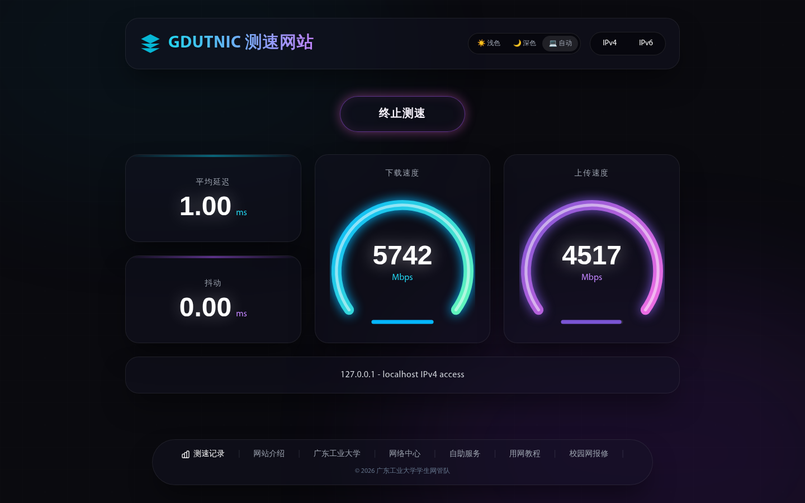
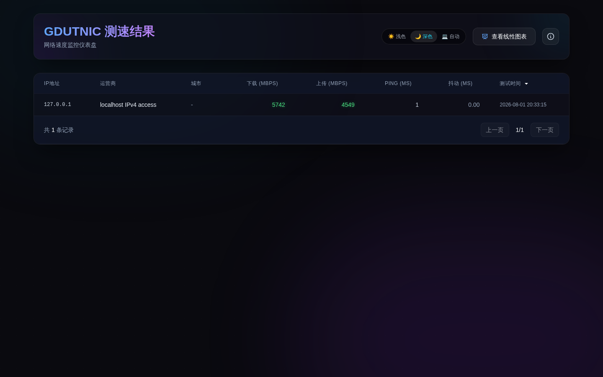
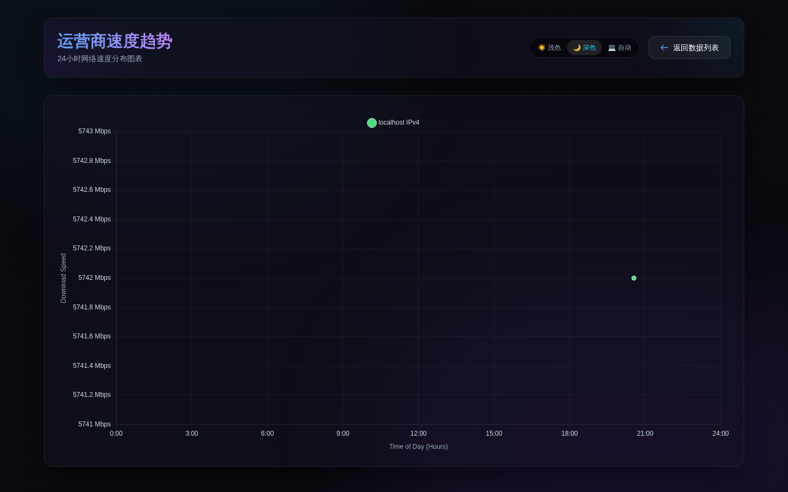

</img>

[](https://git.gdutnic.com/gregPerlinLi/gdutnic-speedtest-x/-/commits/master)

# GDUTNIC 测速网站

本仓库为 [LibreSpeed](https://github.com/librespeed/speedtest) 的延伸项目，LibreSpeed 是一个非常轻巧的网站测速工具。

speedtest-x 使用文件数据库来保存来自不同用户的测速结果，方便您查看全国不同地域与运营商的测速效果。

**❗ 注意**：基于网页测速的原理，程序会生成无用文件供测速者下载来计算真实下行带宽，一定程度上存在被恶意刷流量的风险，在对外分享你的测速页面后，请注意观察服务器流量使用情况，避免流量使用异常。

---

## 截图预览

以下为暗色模式下的页面截图：

<table>
  <tr>
    <td align="center"><b>测速主页面（index.html）</b></td>
    <td align="center"><b>测速结果记录（results.html）</b></td>
  </tr>
  <tr>
    <td></td>
    <td></td>
  </tr>
  <tr>
    <td align="center" colspan="2"><b>运营商速度趋势图表（chart.html）</b></td>
  </tr>
  <tr>
    <td align="center" colspan="2"></td>
  </tr>
</table>

---

## 扩展细节

- 用户测速会上传测速记录并保存至网站服务器
- 不依赖 MySQL，使用文件数据库（SleekDB）
- IP 库改用 [ip.sb](https://ip.sb)，运营商记录更为精确
- 支持浅色 / 深色 / 跟随系统三种主题模式
- 卡片悬浮浮起效果与鼠标光斑跟随效果
- 测速结果支持排序、分页浏览
- 运营商速度趋势图表（24 小时分布）

---

## 部署与使用

### 常规部署（环境要求：PHP 5.6+）

1. 下载本仓库并解压到网站目录，访问 `{域名}/index.html` 进行测速

2. 打开 `{域名}/results.html` 查看测速记录

3. 打开 `{域名}/chart.html` 查看运营商速度趋势图表

> **Tips**：`backend/config.php` 中可定义一些自定义配置：
>
> | 配置项 | 默认值 | 说明 |
> |--------|--------|------|
> | `MAX_LOG_COUNT` | `1000` | 最大可保存多少条测速记录 |
> | `IP_SERVICE` | `'ip.sb'` | 使用的 IP 运营商解析服务（`ip.sb` / `ipinfo.io` / `ip-api.com`） |
> | `SAME_IP_MULTI_LOGS` | `true` | 是否允许同一 IP 记录多条测速结果 |

### Docker 部署（支持平台：amd64 / arm64）

1. 拉取 Docker 镜像：

   ```bash
   docker pull harbor.gdutnic.com/gdutnic-speedtest/speedtest-x:latest
   ```

2. 运行容器：

   ```bash
   docker run -d \
     -p 8087:80 \
     --name speedtest-x \
     --restart always \
     -v /home/speedtest-x:/var/www/html \
     -e TITLE="Your Title" \
     harbor.gdutnic.com/gdutnic-speedtest/speedtest-x:latest
   ```

3. 访问 `{IP}:{端口}/index.html` 进行测速

#### Docker 环境变量

| 环境变量 | 默认值 | 说明 |
|----------|--------|------|
| `WEBPORT` | `80` | 容器内使用的端口 |
| `MAX_LOG_COUNT` | `100` | 最大可保存多少条测速记录 |
| `IP_SERVICE` | `ip.sb` | 使用的 IP 运营商解析服务 |
| `SAME_IP_MULTI_LOGS` | `false` | 是否允许同一 IP 记录多条测速结果 |
| `TITLE` | `GDUTNIC 测速网站` | 网站名称 |

> 如果想让 Docker 容器支持 IPv6，可编辑 `/etc/docker/daemon.json`，加上以下内容（如果不存在这个文件则直接创建）：
>
> ```json
> {
>   "ipv6": true,
>   "fixed-cidr-v6": "fd00::/80",
>   "experimental": true,
>   "ip6tables": true
> }
> ```

---

## 项目结构

```
gdutnic-speedtest-x/
├── index.html              # 测速主页面
├── results.html            # 测速结果记录页面
├── chart.html              # 运营商速度趋势图表页面
├── speedtest.js            # LibreSpeed 测速核心库
├── speedtest_worker.js     # LibreSpeed 测速 Worker
├── backend/                # PHP 后端
│   ├── config.php          # 配置文件
│   ├── report.php          # 测速结果上报接口
│   ├── results-api.php     # 测速结果查询接口
│   ├── getIP.php           # IP 与运营商信息获取
│   ├── garbage.php         # 下载测速垃圾数据生成
│   ├── empty.php           # 下载测速空数据
│   └── SleekDB/            # 文件数据库（JSON 存储）
├── chartjs/                # Chart.js 图表库
├── font/                   # 自定义字体文件
├── docker/
│   └── entrypoint.sh       # Docker 容器启动脚本
├── Dockerfile              # Docker 构建文件
├── .gitlab-ci.yml          # GitLab CI/CD 配置
└── sonar-project.properties # SonarQube 代码质量配置
```

---

## 技术栈

- **前端**：HTML + Tailwind CSS（CDN）+ Canvas 2D + Chart.js
- **后端**：PHP 7.4 + SleekDB（基于 JSON 文件的轻量 NoSQL 数据库）
- **部署**：Docker（php:7.4-apache 基镜像）
- **CI/CD**：GitLab CI + SonarQube

---

## 许可证

MIT License
